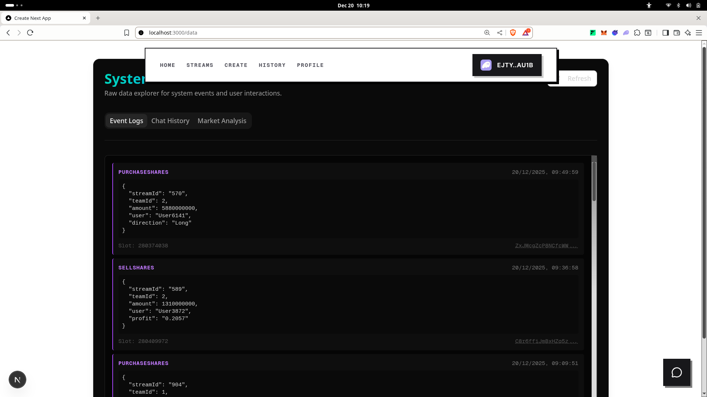
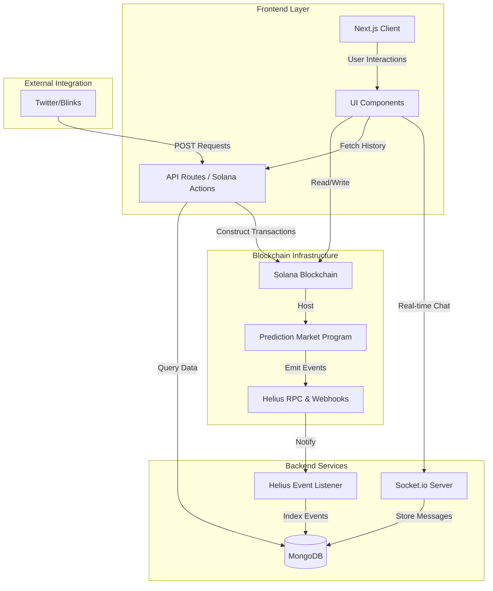

# PROPHECY 🔮

> **Live Sports. Real Stakes.**
> Don't just watch the game. Own the outcome.


## About The Project

**Prophecy** is a decentralized, real-time prediction market built on **Solana** that transforms passive sports viewing into an active trading experience. It combines live video streaming with a high-speed order book, allowing users to buy and sell "shares" of a team dynamically as the match unfolds.

Instead of placing a one-time bet, users trade the outcome of a game like a stock. If a team scores, their share price goes up; if they fumble, it crashes. Users can enter and exit positions instantly, locking in profits before the game even ends.

## Key Features

### 📺 Live Stream & Trade
Seamlessly integrated interface featuring low-latency live video streams (via YouTube/Twitch embeds) side-by-side with real-time price charts. Watch the action and the market simultaneously.


### 📈 Dynamic Bonding Curves
Powered by **Anchor** smart contracts on Solana, ensuring instant trade execution and automated market making. Price discovery happens in real-time based on buy/sell pressure.

### 💬 Real-Time Chat
Engage with other traders in dedicated, wallet-authenticated chat rooms for every stream.
*   **Socket.io Powered:** Instant message delivery to all connected clients.
*   **Wallet Identity:** Chat handle linked to your Solana wallet address for accountability and reputation.


### 🧠 AI Assistant (Gemini)
Built-in AI chatbot powered by Google Gemini to help you make smarter trades.
*   Ask for match stats, player history, or contract details.
*   Get real-time analysis of market trends.
  


### ⚡ Powered by Helius
Utilizes Helius RPCs and event listeners to index on-chain events (Trade Executed, Stream Created, Winnings Claimed) into a MongoDB database for historical analysis and fast frontend retrieval.



### 👀 Solana Blinks Support
Turn any stream into a shareable, interactive **Blink**. Users can bet directly from Twitter (X) or other platforms via your shared link, thanks to standard Solana Actions integration.


## Tech Stack

*   **Blockchain:** Solana (Anchor Framework)
*   **Frontend:** Next.js (React), TailwindCSS, Shadcn UI
*   **Backend:** Node.js (Express), Socket.io
*   **Database:** MongoDB
*   **Infrastructure:** Helius (RPC & Webhooks)
*   **AI:** Google Gemini API

## Getting Started

### Prerequisites
*   Node.js (v18+)
*   Rust & Anchor CLI (for smart contract development)
*   MongoDB Instance
*   Solana Wallet (Phantom/Backpack)

### Installation

1.  **Clone the repository**
    ```bash
    git clone https://github.com/yourusername/prophecy.git
    cd prophecy
    ```

2.  **Install dependencies**
    ```bash
    cd app
    npm install
    ```

3.  **Environment Variables**
    Create a `.env` file in the `app` directory:
    ```env
    MONGO_URI=your_mongodb_connection_string
    HELIUS_RPC_URL=your_helius_rpc_url
    NEXT_PUBLIC_RPC_URL=your_solana_rpc_url # Optional: Defaults to devnet
    ```

### Running the Application

1.  **Start the Next.js Frontend**
    ```bash
    npm run dev
    ```

2.  **Start the Socket Server (for Chat)**
    ```bash
    npm run server
    ```

3.  **Start the Event Listener (for Indexing)**
    ```bash
    npm run listen
    ```

## Architecture



The application follows a modular architecture:
1.  **Smart Contracts:** Handle logic for creating streams, minting shares, and treasury management.
2.  **Helius Listener:** Listens for `SharesPurchased` events and syncs state to MongoDB.
3.  **Socket Server:** Handles ephemeral chat data and user presence.
4.  **Next.js Client:** Aggregates on-chain data, DB history, and live stream into a unified UI.

## License

Distributed under the MIT License. See `LICENSE` for more information.
